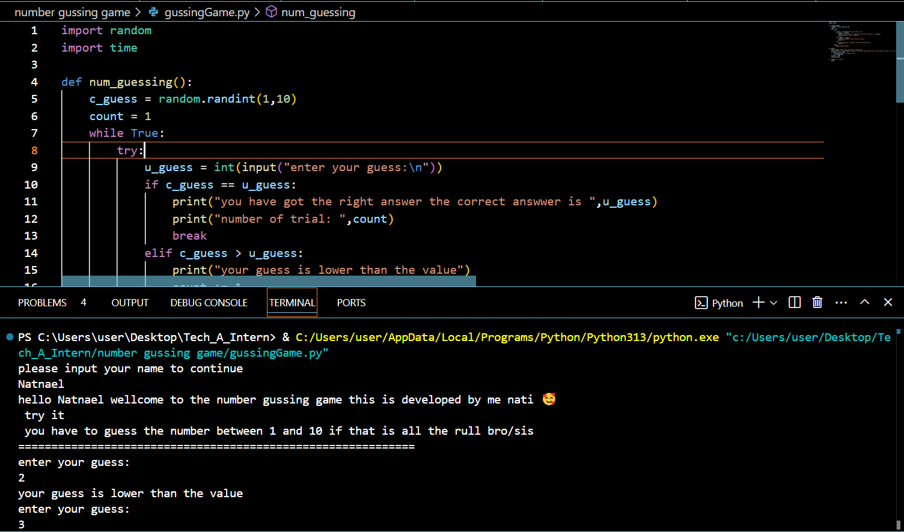

## Task Report

### Level-1 Tasks

### Task 1: Number Guessing Game
#### Description:
This Python script implements a simple Number Guessing Game:
1. A random number between 1 and 100 is generated.
2. The user is asked to guess the number.
3. The game provides feedback:
   - If the guess is out of range, an error is raised.
   - If the guess is incorrect, the program gives hints (`Too high` or `Too low`).
4. The game continues until the correct number is guessed.
5. When the user guesses correctly, a congratulatory message is displayed.

This game demonstrates basic error handling and random number generation in Python.

#### Output:  

📌 Level-1_Task-1_Number_Guessing_Game

### Task 2: Countdown Clock
#### Description:
This Python script implements a countdown timer that:
1. Continuously calculates the remaining time until a specified end date and time.
2. Displays the remaining days, hours, minutes, and seconds.
3. Uses the `datetime` module to track the current time.
4. Pauses execution every second using `time.sleep(1)` to avoid excessive CPU usage.
5. Prints "Countdown expired!" when the target time is reached.

This script can be modified for event countdowns, deadlines, or timers.

#### Output:  

📌 Level-1_Task-2_Countdown_Clock

### Task 3: Quiz Application
#### Description:
This Python program implements a multiple-choice quiz, with features such as:
1. Random question selection using `random.sample()`.
2. Multiple-choice format where users enter their answers (A, B, C, or D).
3. Score tracking: The user earns points for correct answers.
4. Time tracking: The total time taken to complete the quiz is recorded.
5. User feedback: Displays whether an answer is correct or incorrect.
6. Final score calculation: Shows the number of correct answers out of total questions.

This script can be extended by adding more questions or implementing a GUI-based quiz system.

#### Output:  

📌 Level-1_Task-3_Quiz_Application
## Level-2 Tasks
### Task 1: Credit Card Validator
#### Description:
This script validates credit card numbers using the Luhn algorithm:
1. Removes non-numeric characters from user input.
2. Ensures the number is 16 digits long.
3. Applies the Luhn algorithm:
   - Doubles every second digit.
   - If a doubled digit exceeds 9, subtracts 9.
   - Sums all digits.
   - If the sum is a multiple of 10, the card is valid.
4. Prints whether the credit card number is valid or invalid.

This implementation can be extended to check for card issuers (Visa, Mastercard, etc.).

#### Output:  
📌 Level-2_Task-1_Credit_Card_Validator  

### Task 2: Location Finder
#### Description:
This Python script fetches GPS coordinates using the `geopy` library:
1. The user enters a location (e.g., city, country).
2. The `Nominatim` geocoder retrieves latitude and longitude.
3. If the input is invalid, the program prompts the user again.
4. If geolocation services fail, the script handles errors gracefully.

This script is useful for address lookup applications, travel apps, and mapping services.

#### Output:  
📌 Level-2_Task-2_Location_Finder
### Task 3: Document Scanner
#### Description:
This script uses OpenCV to detect and extract documents from images:
1. Loads an image using `cv2.imread()`.
2. Converts it to grayscale and applies Gaussian blur.
3. Uses Canny edge detection to highlight the document edges.
4. Identifies the largest contour in the image.
5. Draws a bounding box around the detected document.
6. Saves the processed image as `"scanned_document.jpg"`.

This script is a basic implementation of document scanning technology and can be extended to include perspective correction and OCR (Optical Character Recognition).

#### Output:  
📌 Level-2_Task-3_Document_Scanner
## Level-3 Tasks
### Task 1: Payment Application
#### Description:
This Python script simulates a basic payment system:
1. The user enters a payment amount.
2. The script validates the amount:
   - It must be a positive number.
   - If invalid, the user is prompted again.
3. If valid, the payment is processed successfully.

This basic structure can be expanded for real-world payment processing systems by integrating payment gateways (e.g., Stripe, PayPal).

### Level-3 Task Output
Below is the output for Level-3 Task-2: Payment Application:

#### 📌 Level-3_Task-2_Payment_Application

### Expected Console Output:
#### ✅ Valid Payment Scenario
💰 Enter payment amount: $50
💳 Processing payment of $50.00...
✅ Payment successful! Thank you for your transaction.
#### ❌ Invalid Payment Scenario (Negative or Zero Input)

💰 Enter payment amount: $0
❌ Error: Amount must be a positive number.
🔄 Please enter a valid amount.

#### ❌ Invalid Payment Scenario (Non-Numeric Input)
💰 Enter payment amount: abc
❌ Error: could not convert string to float: 'abc'
🔄 Please enter a valid amount.
This output confirms that the Payment Application:
✔ Validates user input (positive numbers only)  
✔ Handles incorrect input gracefully  
✔ Processes payment successfully when the conditions are met  
